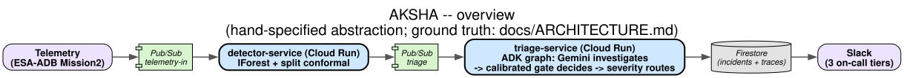

# AKSHA

## What it is

Spacecraft telemetry monitoring today is mostly fixed-threshold out-of-limit
alarms: context-blind, and at real telemetry volume even a small false-alarm
rate floods the control room until operators start ignoring alerts. A
detector emitting a score doesn't say which channel drifted, whether the
pattern matches a known failure mode, or who should be woken up — closing
that gap is a manual, 7-step operator triage loop today. AKSHA automates it:
an Isolation Forest detector with split-conformal calibration flags anomalies
in real time, a deterministic gate — calibrated on distance to known
rare-event exemplars, not an LLM's judgment — decides real-vs-false-alarm,
and Gemini explains the decision in language an operator can act on without
ever being allowed to change it. Event-driven, runs on a live telemetry
stream, no human in the loop for routine cases.

## Architecture



Detailed graph, generated from the live `Workflow.graph.edges`: [docs/ARCHITECTURE.md](docs/ARCHITECTURE.md)

Two Cloud Run services on a two-topic split-queue: **detector-service** (fast
path, ms-scale — IForest + split conformal, deterministic, no LLM) publishes
to Pub/Sub, and **triage-service** (slow path) runs the 5-stage pipeline —
detect, investigate, explain, file_report, route — as a real ADK 2 `Workflow`
graph with two Gemini agent nodes and dict-edge routers. The **deterministic
gate** (`verification_gate`) decides `confirm` / `disputed` / `reject` from
calibrated distance alone; the LLM's read is recorded for audit but never
touches the routing outcome.

Design docs: [PRD](docs/PRD.md), [TRD](docs/TRD.md), [ADRs](docs/adr/).

## Google technologies used

| Technology | Where |
|---|---|
| **Gemini 3.5 via Vertex AI** | `gemini-3.5-flash` (investigator agent), `gemini-3.5-flash-lite` (explainer agent) — both on Vertex's global endpoint, `GOOGLE_GENAI_USE_ENTERPRISE=True` |
| **ADK 2** | `google-adk==2.3.0` — `Workflow`, `Agent` and `FunctionNode` graph nodes, dict-edge routers, all 5 stages of the triage graph |
| **Cloud Run** | `detector-service` (fast path), `triage-service` (slow path) — both scale to zero |
| **Pub/Sub** | `telemetry-in` (detector-service inbound), `triage` (detector → triage-service), each with a DLQ |
| **Firestore** | `incidents/{id}` (final state), `traces/{id}/steps/{n}` (per-node audit trail) |
| **Secret Manager** | `slack-flight-director`, `slack-subsystem`, `slack-log` — one webhook per severity tier |
| **Artifact Registry** | built container images, pushed by Cloud Build on every `gcloud run deploy --source` |

## Results

Full writeup, every number sourced and cross-checked against
`eval/outputs/final_report.json`: **[docs/EVALUATION.md](docs/EVALUATION.md)**.
Headline numbers, all measured live (not copied from any prior report):

- **Gate 88.5%** (177/200) vs. **LLM alone 51.5%** (103/200) confirm rate on
  200 held-out faults — the gate's calibrated distance decides; the model's
  read is audit-only and measurably worse on its own.
- **Golden set: 18/18 (100%)** scored agreement across 22 fixed windows.
- **Detector**: accuracy 0.979, MCC 0.666, AUC-ROC 0.853, AUC-PR 0.653
  (positive class `rare_event ∪ anomaly`).
- **Separability AUC**: 0.795 (fault vs. expected), 0.610 (anomaly vs.
  rare_event) — the recognition distance separates the classes, but not
  cleanly, which is why the gate is three-way (`confirm`/`disputed`/`reject`)
  rather than a binary cut.

**Honest scoping**: no anomaly-only detection metric (precision/recall/F1/MCC
restricted to the `anomaly` label) is reported anywhere in this project. The
Mission2 test split contains exactly 4 anomaly-labelled windows, all from a
single event on 2001-12-14 — too few positives to support a meaningful
number, a limitation of the benchmark on this channel subset, not something
tuned around. The 7 benchmark-style metrics above pool `rare_event ∪ anomaly`
instead, which is ESA-ADB's own convention for the same reason.

## Spin-up

**Prerequisites**: Python 3.11+, the `gcloud` CLI, a GCP project with billing
enabled and this repo's default project id (`aksha-hackathon`) or your own.

```
gcloud auth login
gcloud auth application-default login
gcloud config set project aksha-hackathon
gcloud services enable run.googleapis.com pubsub.googleapis.com firestore.googleapis.com aiplatform.googleapis.com artifactregistry.googleapis.com cloudbuild.googleapis.com secretmanager.googleapis.com billingbudgets.googleapis.com
pip install -r requirements.txt
```

The trained detector, calibration, and context reference are **committed**
(`aksha_core/artifacts/`), so deploying does *not* need the steps below —
skip straight to "Deploy". They're only for reproducing the build from raw
data:

```
python3 scripts/fetch_mission2.py          # ESA-ADB Mission2, 3.8 GB, the build dataset (ADR-015)
python3 -m aksha_core.data.mission2        # raw -> data/processed/mission2_features.parquet
python3 scripts/train_detector.py          # -> aksha_core/artifacts/mission2_iforest.joblib
python3 scripts/build_context_reference.py # -> aksha_core/artifacts/mission2_context_reference.json
python3 scripts/calibrate_recognition.py   # -> aksha_core/artifacts/mission2_recognition_calibration.json
```

OPSSAT-AD is cited for operator-requirements framing only (ADR-015) and isn't
needed by the pipeline itself, but its fetch script is included for reference:
```
python3 scripts/fetch_data.py
```

**Deploy** (both default to project `aksha-hackathon`, region `us-central1`
if no args given):
```
scripts/deploy_detector.sh [PROJECT_ID] [REGION]
scripts/deploy_triage.sh [PROJECT_ID] [RUN_REGION]
```

**Dashboard** — read-only view over live Firestore state (recent incidents,
per-node trace, gate-vs-LLM audit block), run locally with ADC:
```
streamlit run aksha_agent/dashboard/app.py
```

## Repository layout

```
aksha_core/     detection + conformal calibration core — zero google/adk/vertexai imports (ADR-002)
aksha_agent/    ADK graph, GCP infra glue, dashboard — imports core, never the reverse
scripts/        fetch, train, calibrate, deploy, eval, diagram-render, dev tooling
docs/           PRD, TRD, ADRs, evaluation writeup, generated architecture diagram
tests/          pytest suite for both aksha_core and aksha_agent
eval/           eval harness outputs (gitignored, regenerable)
data/           fetched/processed datasets (gitignored, regenerable)
```

## Design decisions

[PRD](docs/PRD.md) (product framing, success criteria), [TRD](docs/TRD.md)
(pipeline, data contracts), and 15 [ADRs](docs/adr/) recording every decision
that would otherwise need re-litigating — including one, ADR-015, that
supersedes an earlier one after the build dataset changed mid-project. ADRs
exist here so a reviewer can trace *why* a choice was made without asking the
person who made it, and so a later decision that invalidates an earlier one
(ADR-006 → ADR-015, ADR-012's premise) leaves a record instead of just
silently drifting.

## Disclosure & data

All code written during the All Things Agentic submission period. No
pre-existing code incorporated.

The detector, gate calibration, and golden set are built on **ESA-ADB's
Mission2** benchmark (CC BY 3.0 IGO), specifically its lightweight channel
subset (channels 18–28) — see [ADR-015](docs/adr/ADR-015.md):

> Kotowski, K., Haskamp, C., Andrzejewski, J., Ruszczak, B., Nalepa, J., Lakey, D., Collins, P., Kolmas, A., Bartesaghi, M., Martínez-Heras, J., De Canio, G. (2024). *European Space Agency Benchmark for Anomaly Detection in Satellite Telemetry*. arXiv:2406.17826. Dataset: Zenodo, DOI: [10.5281/zenodo.15237121](https://doi.org/10.5281/zenodo.15237121).

**OPSSAT-AD** (CC-BY 4.0) is cited for its operator-requirements framing, not
as build data — see [ADR-006](docs/adr/ADR-006.md) (superseded by ADR-015):

> Ruszczak, B., Kotowski, K., Evans, D., Nalepa, J. et al. (2025). *The OPS-SAT benchmark for detecting anomalies in satellite telemetry*. Scientific Data. Dataset: Zenodo, DOI: [10.5281/zenodo.15108715](https://doi.org/10.5281/zenodo.15108715).

**License**: Apache License 2.0. See [LICENSE](LICENSE).
