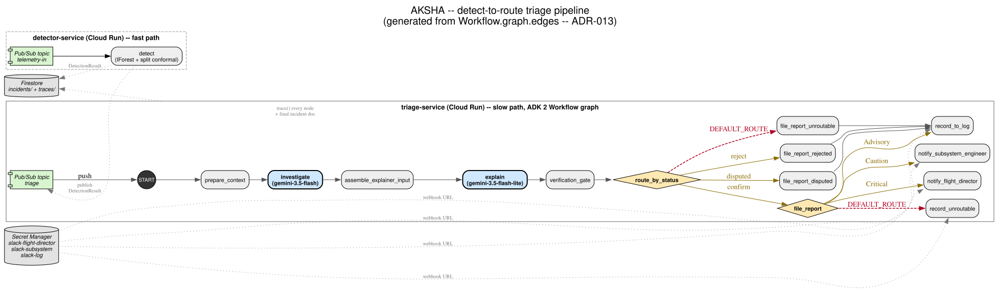

# AKSHA — Architecture (detailed)

The README's diagram is a 7-box, hand-specified abstraction for a one-glance
read. This is the ground truth: every node and edge below is read straight
from the live `Workflow.graph.edges` object, not drawn by hand.



Two Cloud Run services on a two-topic split-queue: **detector-service** (fast
path, ms-scale — IForest + split conformal, deterministic, no LLM) publishes
to Pub/Sub, and **triage-service** (slow path) runs the 5-stage pipeline —
detect, investigate, explain, file_report, route — as a real ADK 2 `Workflow`
graph with two Gemini agent nodes and dict-edge routers. The **deterministic
gate** (`verification_gate`) decides `confirm` / `disputed` / `reject` from
calibrated distance alone; the LLM's read is recorded for audit but never
touches the routing outcome.

ADR-013's consequence extended to pictures: rename a node in
`aksha_agent/graph/workflow.py` and this diagram changes with it, because
nothing here is hand-drawn — `scripts/render_diagram.py` reads
`scripts/dump_graph.py`'s `collect()`, which walks `workflow.graph.edges`
directly. Regenerate both this diagram and the README's overview with:
```
python3 scripts/render_diagram.py
```
